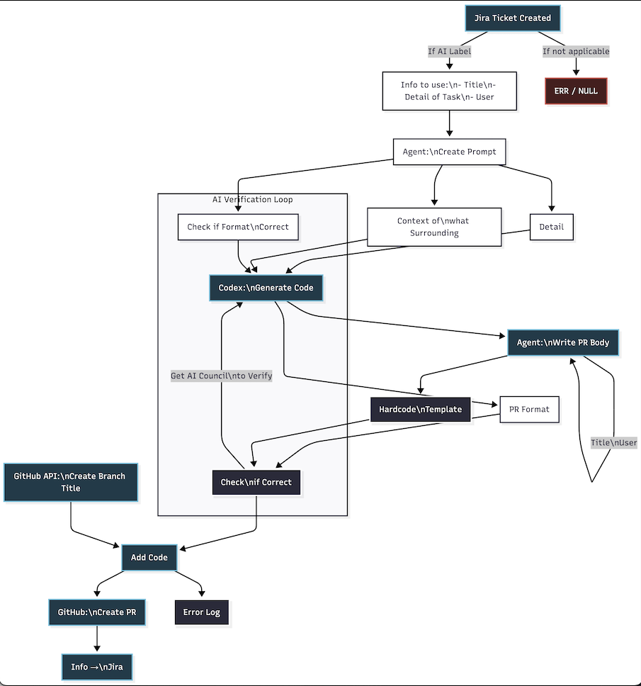
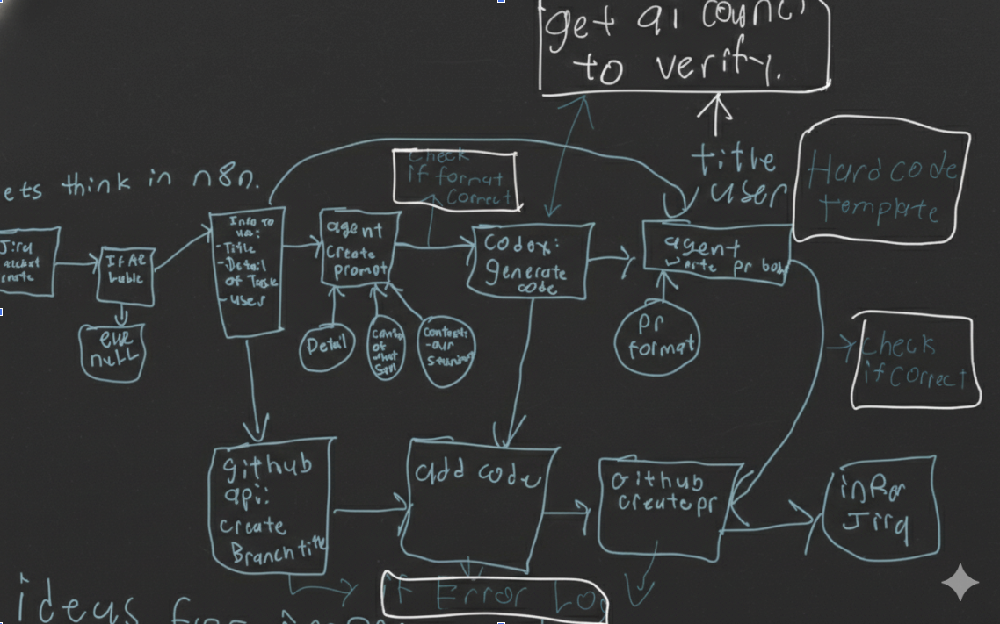

# AI-Powered Automatic PR Creation Demo

This repository is not just code for the product — **the repository itself is the product demo**.

It showcases my first working solution for **automatically creating pull requests using AI and automation**. Instead of only describing the idea, this repo demonstrates how the system behaves in practice through the actual branches, generated changes, and pull request flow created by the automation.

This project started as an MVP to prove that AI-assisted PR generation could work in a practical development workflow. It is now being used as the foundation for a larger internal implementation at **Savi Finance**, where the system will be expanded further using **AWS** and additional production-grade infrastructure.

---

## Demo Video

)

)

## What this project is

This project is a working demo of an **AI-driven pull request creation system**.

The goal of the system is to take development work that would normally require manual effort and automate part of the workflow by:

- generating code changes with AI
- creating a new branch automatically
- committing the generated changes
- opening a pull request through automation
- demonstrating how the full workflow can operate as a system, not just as a script

This repository exists to show that process end to end.

Rather than being a traditional app with a front-end and backend interface, this repo acts as a **live proof of concept**. The demo is visible through the structure of the repository itself, including the AI-generated branch and the resulting pull request created by the automation.

---

## System Design
Polished:

Original:

## Why this project is interesting

A lot of people talk about AI-assisted software development at a high level. This project is interesting because it turns that idea into something concrete and inspectable.

You can see:

- the branch created by the system
- the changes made by AI
- the pull request opened by the automation
- how the workflow behaves as an MVP in a real repository

That makes this repo both a technical prototype and a product demonstration.

---

## The repo itself is the demo

This is the most important part of the project:

**the repository itself is the product demo.**

To understand the system, you do not just read about it — you inspect the repo and see the workflow in action.

Inside this repository, you can explore:

- the branch created by AI
- the PR created by the automation
- the code and structure used to power the MVP
- the demonstration video showing how the system works end to end

This makes the repo a hands-on example of the concept rather than just a static codebase.

---

## What this MVP proves

This MVP was built to answer a simple question:

**Can AI and automation be combined to create meaningful pull requests in a repeatable way?**

This demo shows that the answer is yes.

It proves that a workflow can be designed where:

- AI contributes generated implementation work
- automation handles repository operations
- pull requests can be created programmatically
- the process can be demonstrated in a way that engineering teams can inspect and evaluate

This is the first version of that idea, built to validate the concept before scaling it further.

---

## Current status

This repository represents the **first MVP** of the system.

It is not the final production implementation. Instead, it is the early proof of concept that demonstrates how the workflow can function.

The next stage is a deeper internal buildout with the team at **Savi Finance**, where the concept will be expanded using **AWS** and more robust production architecture.

A more detailed explanation of the larger system and its future design can be found in the supporting documentation.

---

## What to look at in this repo

To understand the demo, check the following:

- the demo video showing the workflow in action
- the AI-generated branch
- the pull request opened by the automation
- the repository structure that powers the MVP

Together, these pieces show how the system works and why this repo is more than just a normal codebase.

---

## Core idea

The core idea behind this project is simple:

development workflows contain repetitive steps that can be automated, and AI can help generate the actual implementation work that feeds those workflows.

This MVP explores that idea through pull request creation.

Instead of stopping at code generation, the system continues into the development lifecycle by packaging that work into a branch and PR flow that developers can review.

That is what makes this more of a systems project than just an AI coding experiment.

---

## Why I built this

I wanted to build a first real solution for automatic PR creation that could move beyond theory and act as a tangible demo.

This project let me explore:

- AI-generated development workflows
- repository automation
- branch and PR orchestration
- MVP system design
- how a prototype can communicate value clearly to internal stakeholders

It also helped me think more deeply about how internal developer tooling should be designed: not just to automate isolated tasks, but to support real engineering workflows from end to end.

---

## Future direction

This MVP is now serving as the starting point for a larger internal system at **Savi Finance**.

Future versions will expand on this concept with stronger infrastructure, deeper automation, and cloud-native implementation details using AWS.

This repository remains the first demonstration of the idea — the point where the system moved from concept into something real and inspectable.

---

## Additional documentation

More details about the broader system design, future architecture, and internal implementation direction can be found in the accompanying document.

---

## Final note

This project is important to me because it represents my first concrete solution for automatic AI-powered PR creation.

It is an MVP, but it is also a real demonstration of how the idea works. The branch, the PR, and the repo itself all act as evidence of the system in action.

That is what makes this repository different:

it does not just describe the product — **it is the product demo**.
